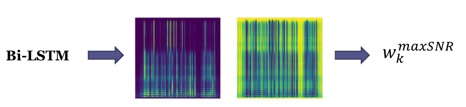

# nn-gev pytorch
This is a repository for nn-gev beamformer based on PyTorch

# Overall Flow



# How to train
```
./train.sh
```
# How to evaluate
```
./test.sh
```
# Citation

# License
All codes are under MIT_LICENSE
